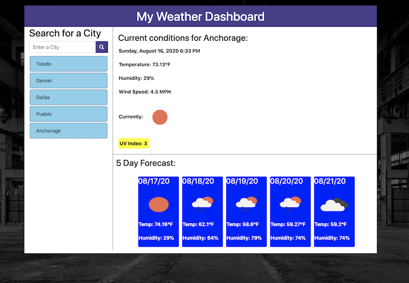

# Weather App
## Introduction
This application helps the user see the weather forcast for a city of their choosing. Searching for a valid city will show the current weather conditions including Temperature, UV index, Humidity, and Wind Speed. A 5-day forcast will also be displayed for the selected city. Searched cities will be saved for quick reference.

## Technologies Used
* HTML
* CSS
* JavaScript
* jQuery
* Bootstrap
* FontAwesome
* MomentJS

## Screenshots

 

## Deployed Application
The deployed application can be found [here](https://maynperalta.github.io/MyWeatherApp/).

## Contact infomation
I can be contacted via email at <maynperalta@gmail.com>.