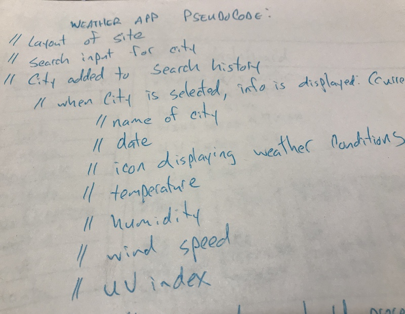
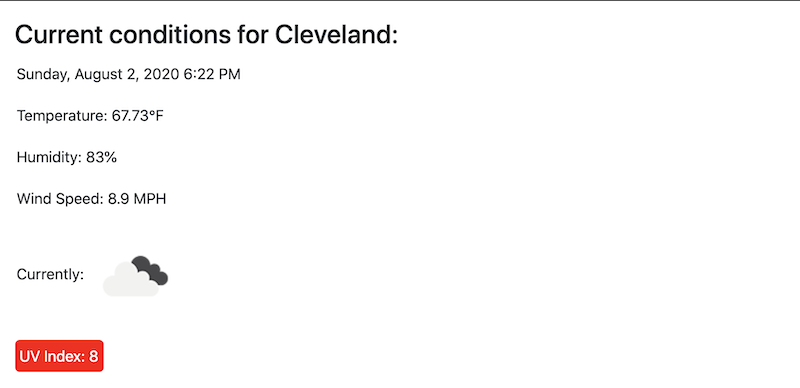
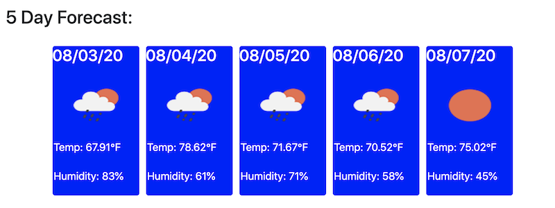
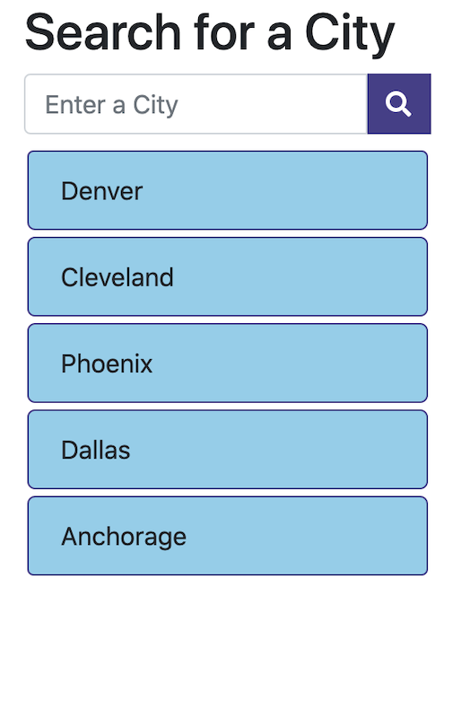

# MyWeatherApp
## Overview
For this assignment, we were required to create a weather app which would allow us to search a city to see current weather conditions. We were to make a call to the Open Weather Map API in order to pull the data and show current date, temperature, humidity, wind speed, UV index, an icon showing the conditions as well as a 5-day forecast for conditions for that city. The city would then be put into a list which would allow users to revisit past cities by clicking on them. The UV index also needs to have a color indicator which will display based on if the UV conditions are okay, moderate, or severe.

### Process
For this assignment, we weren't given any templates to start with. All we were given is the User Story, acceptance criteria, and a screenshot of what the finished app could look like. We had to code our own HTML, CSS, and JavaScript from the ground up. I decided to use Bootstrap CSS, although it's not my favorite, because by looking at the example picture I was able to visualize rows and columns to lay out the app. As with any project I decided to start with a pseudo code. I don't always have access to my computer, but I'm constantly thinking of my assignments and how to approach them. In this case, pen and paper would have to do.

I decided the easiest way to approach this would be to divide it into three parts and tackle them separately. Of course, all three would be intertwined with each other and would all fire off with the simple click of one button, but taking them on one at a time seemed to give me a better focus. These three parts would include the current conditions, 5-day forecast, and the list of past searched cities.

#### Section 1 - Current Conditions

This section would display the current conditions for a given city with data pulled from the Open Weather Map API. The HTML would be generated dynamically via jQuery. So, when a city is typed into the search box, this area would populate with the name of the city, today's date, current temperature, wind speed, humidity, and an icon to represent the conditions. Using a card component of Bootstrap made this an easy part to create. The API call would take the city that was typed into the search field and plug it into the URL which would then give us the data we need. I would have to convert K to °F for the temperature as well as m/s to MPH for the wind speed, so there was a little bit of extra code and a few other variables in order to present this data in the imperial system (which America refuses to let go of). Every new entry for this data that was appended would appear on its own line resulting in a clean layout. The UV index, however, would not only need a color indication of severity, but it would need to be pulled from a second API call. 

#### Section 2 - 5-Day Forecast

We were told in class during the homework assignment presentation that we would need to make multiple API calls in order to get all of the data required to meet the acceptance criteria. I was able to get everything I needed with two. One would include everything in the current conditions section except for the UV index. That would be data received through a second API call. The second call would also give me all of the data I'd need for the 5-day forecast. To create the 5-day forecast, I'd have to create some elements in jQuery using Bootstrap classes. I decided that some cards would give the best presentation. In order to do this, I would need a for loop in order to create five cards which would populate with the information over the five days. This second call wouldn't use the city name as the first call did. Instead, it would need the global coordinates for the city being searched. So, I'd need some variables in order to plug into the second API call to get the conditions for the city at those coordinates. A bit of extra work, but I didn't write Open Weather Map, so I have to work with what they provide. This five day forecast would include the date, temperature, humidity, and an icon representing the conditions on that particular date. While coding this forecast using a second API call, a classmate helpfully informed me of a way to pull the data using imperial measurements right off of the bat instead of having to convert them. I didn't really want to spend precious time going back to re-code the previous section so I left it as is (besides, knowing how to convert the data seems like a good skillset to have). For this section, however, I didn't need to create extra variables and conversions, which resulted in a little less to type out. 

#### Section 3 - City Search and History

The third section would be where we typed in a city and it would create the HTML to show the current conditions and 5-day forecast. The input and search did have to be created first in order for the other two sections to function, but creating the list and ensuring it worked correctly would be the last bit I had to work on. This list is created using a for loop which will take the city name that was typed into the input field and push it into an array which was given the variable "cities". The cities array would then be used to generate a list of buttons that can be used to quickly retrieve the weather data for past searched cities instead of having to type them in again. There would be two functions tied to the search button: one to pull the weather data, and another to create a list of past searched cities.

#### Final Thoughts and conclusion

This was a challenging assignment, but not as stressful as past assignments. I was surprised with how much I had learned along the way so far. Being able to create a for loop which generated cards to house API data for a 5-day forecast is something I doubted myself on being able to do. Actually doing it and getting it to work is something I'm pretty happy with. More notes can be found in the code itself. A gif of the app in operation is below.

